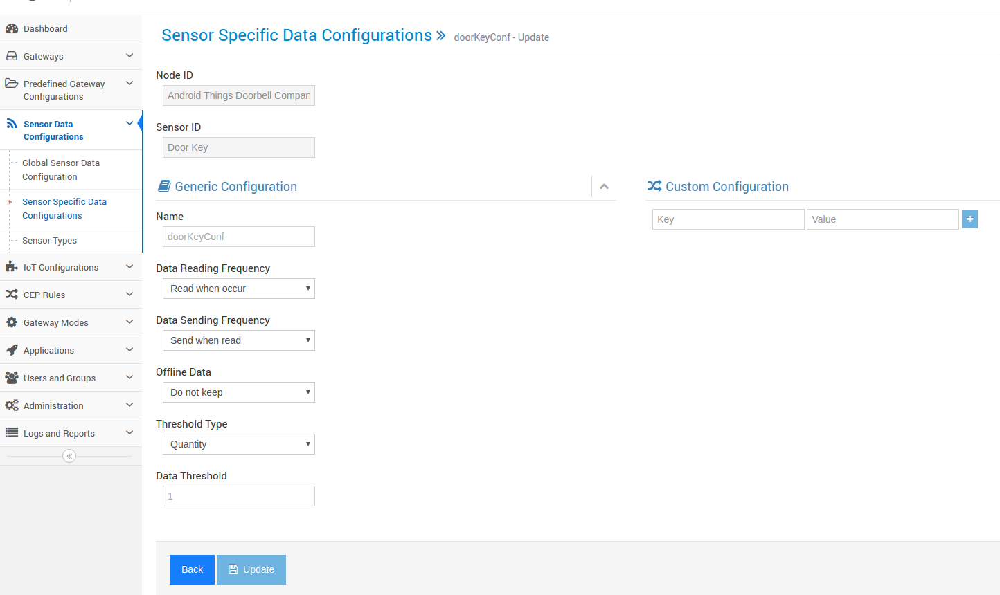

Android Things Doorbell sample
=====================================

The Android Things Doorbell sample demonstrates how to create a “smart” doorbell.
The sample captures a button press from a user, obtains an image via a camera peripheral,
processes the image data using Google’s Cloud Vision API, and uploads the image, Cloud Vision
annotations and metadata to a Firebase database where it can be viewed by a companion app.

Companion app shows nofitication when user pressed button. Door could be opened from the application.


Pre-requisites
--------------

- Android Things compatible board
- Android Things compatible camera (for example, the Raspberry Pi 3 camera module)
- Android Studio 2.2+
- "Google Repository" from the Android SDK Manager
- Google Cloud project with Cloud Vision API enabled
- Firebase database
- IoTIgnite Agent
- The following individual components:
    - 1 push button
    - 2 resistor
    - jumper wires
    - 1 breadboard
    - 1 led


Schematics
----------


Setup and Build
===============

To setup, follow these steps below.

1. Add a valid Google Cloud Vision API key in the constant `CloudVisionUtils.CLOUD_VISION_API_KEY`
 - Create a Google Cloud Platform (GCP) project on [GCP Console](https://console.cloud.google.com/)
 - Enable Cloud Vision API under Library
 - Add an API key under Credentials
 - Copy and paste the Cloud Vision API key to the constant in `CloudVisionUtils.java`

2. Add a valid `google-services.json` from Firebase to `app/` and
   `companionApp/`
 - Create a Firebase project on [Firebase Console](https://console.firebase.google.com)
 - Add an Android app with your specific package name in the project
 - Download the auto-generated `google-services.json` and save to `app/` and `companionApp/` folders

There are two modules: `app` and `companionApp`, the former is on device while the latter on
companion device e.g. Android phone.

Running
=======

To run the `app` module on an Android Things board:

1. Connect a push button to your device's GPIO pin according to the schematics below
2. Deploy and run the `app` module
3. Take a picture by pushing the button
4. Verify from Firebase Console that pictures are uploaded to a log in the Firebase database
   of your project
5. Verify from Firebase Console that the uploaded pictures in the log get annotations after
   a small delay from the GCP Cloud Vision

To run the `companionApp` module on your Android phone:

1. Deploy and run the `companionApp` module
2. Verify that you see a new annotated picture everytime you push the button
3. See the notification on screen. Unlock or keep door locked.


IoT-Ignite Integration
======================

IoT-Ignite is a Platform as a Service (PaaS) distinctively designed for realization of Internet of Things. It provides a secure, reliable gateway connection between your devices and the web and allows you to manage your devices, data flow, data streaming and rule definitions.

In order to connect your hardware or device to IoT-Ignite platform, IoT-Ignite device SDK is used. This work here demonstrates to create an application development using IoT-Ignite SDK. For this purpose, on android studio "repositories" and "dependencies" part under the build.gradle file are created as below;

```
repositories {
 mavenCentral()
 maven {
     url "https://repo.iot-ignite.com/content/repositories/releases"
 }
}

dependencies {
 compile 'com.ardic.android:IoTIgnite:0.7'
 compile 'com.google.code.gson:gson:2.7'
}
```

In addition, below part should be discarded from AndroidManifest.xml file to use Ignite Agent application which  provides connection with Ignite Cloud;

```
<!-- Launch activity automatically on boot -->
    <intent-filter>
          <action android:name="android.intent.action.MAIN"/>
          <category android:name="android.intent.category.IOT_LAUNCHER"/>
          <category android:name="android.intent.category.DEFAULT"/>
    </intent-filter>
```

Next Steps
======================

Sensor data configuration; Data Reading, sending to cloud, keeping offline data etc configurations can be defined as follows.

The door bell sends "1" when ring button pushed.


When user pressed doorbell button cloud rule triggers the companionApp and starts
an activity for respond to lock/unlock the door.





CEP Rule; You can define the CEP rules from devzone area as below. After events are occurred given actions are taken.


When doorbell's rang app on the android thing's send info data to IoT-Ignite
then companionApp recevies and shows the notification screen.


When you clicked unlock/keepLocked buttons doorbell recevies an action and blinks the LED. Splashing led means door going to be kept locked.

If the door unlocked led stays on for a while.

License
-------

Copyright 2016 The Android Open Source Project, Inc.

Licensed to the Apache Software Foundation (ASF) under one or more contributor
license agreements.  See the NOTICE file distributed with this work for
additional information regarding copyright ownership.  The ASF licenses this
file to you under the Apache License, Version 2.0 (the "License"); you may not
use this file except in compliance with the License.  You may obtain a copy of
the License at

  http://www.apache.org/licenses/LICENSE-2.0

Unless required by applicable law or agreed to in writing, software
distributed under the License is distributed on an "AS IS" BASIS, WITHOUT
WARRANTIES OR CONDITIONS OF ANY KIND, either express or implied.  See the
License for the specific language governing permissions and limitations under
the License.
